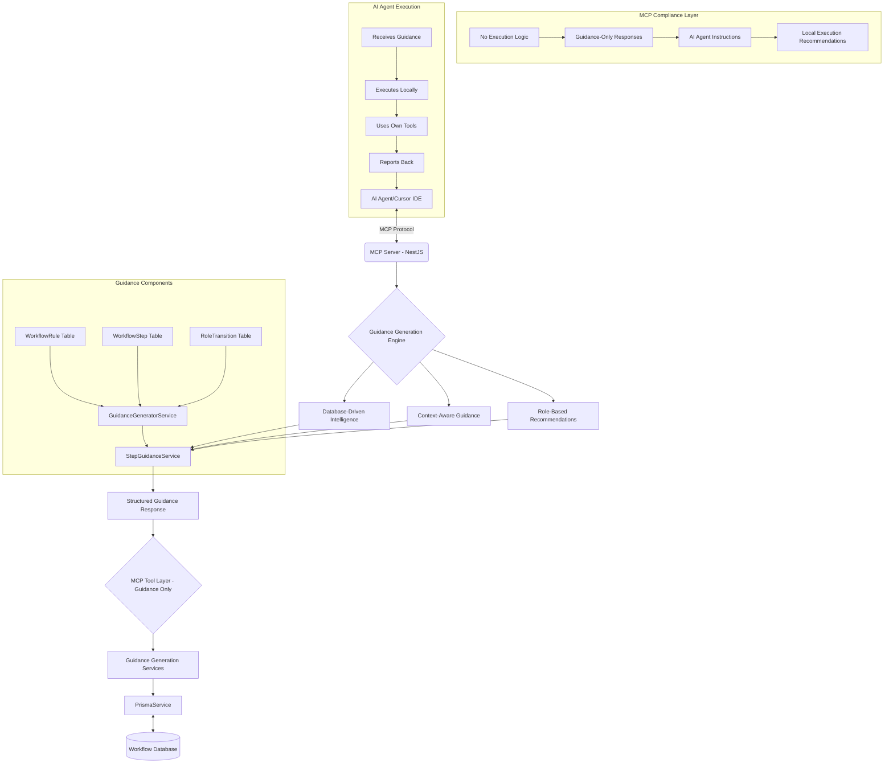

# Technical Architecture (v1.2.11)

## Repository Pattern Implementation

### Architecture Overview

Anubis v1.2.11 implements a clean Repository Pattern that separates business logic from data access concerns:

```typescript
// Repository Interface Pattern
export interface IWorkflowRoleRepository {
  findByName(name: string): Promise<WorkflowRole | null>;
  findTransitionsFromRole(roleId: string): Promise<RoleTransition[]>;
  create(data: CreateWorkflowRoleData): Promise<WorkflowRole>;
}

// Implementation with Prisma
@Injectable()
export class WorkflowRoleRepository implements IWorkflowRoleRepository {
  constructor(private prisma: PrismaService) {}

  async findByName(name: string): Promise<WorkflowRole | null> {
    return this.prisma.workflowRole.findFirst({ where: { name } });
  }
}
```

### Migrated Services (225% Success)

The following 9 services successfully migrated to repository pattern:

1. **workflow-guidance.service.ts**

   - Separation: Business logic → Repository data access
   - Benefit: Enhanced testability and maintainability

2. **step-progress-tracker.service.ts**

   - Pattern: Progress calculation → Database persistence
   - Benefit: Clean state management

3. **workflow-bootstrap.service.ts**

   - Architecture: Initialization logic → Data creation
   - Benefit: Simplified bootstrap process

4. **progress-calculator.service.ts**

   - Design: Computation → Data retrieval
   - Benefit: Pure business logic functions

5. **step-query.service.ts**

   - Pattern: Query logic → Repository abstraction
   - Benefit: Flexible data access strategies

6. **step-execution.service.ts**

   - Architecture: Execution flow → State persistence
   - Benefit: Reliable execution tracking

7. **role-transition.service.ts**

   - Design: Transition logic → Database operations
   - Benefit: Consistent role management

8. **execution-data-enricher.service.ts**

   - Pattern: Data enrichment → Repository queries
   - Benefit: Efficient data aggregation

9. **workflow-guidance-mcp.service.ts**
   - Architecture: MCP integration → Clean data access
   - Benefit: Standardized MCP operations

## Dependency Injection Architecture

### Service Layer Organization

```typescript
// Module Structure
@Module({
  imports: [PrismaModule],
  providers: [
    // Repository Implementations
    WorkflowRoleRepository,
    TaskRepository,
    StepRepository,

    // Business Services
    WorkflowGuidanceService,
    StepProgressTrackerService,
    RoleTransitionService,
  ],
  exports: [
    WorkflowGuidanceService,
    StepProgressTrackerService,
    RoleTransitionService,
  ],
})
export class WorkflowRulesModule {}

// Service Constructor Injection
@Injectable()
export class WorkflowGuidanceService {
  constructor(
    private readonly workflowRoleRepository: IWorkflowRoleRepository,
    private readonly stepRepository: IStepRepository,
    private readonly logger: Logger,
  ) {}
}
```

## Database Access Layer

### Prisma Integration with Repository Pattern

```typescript
// Repository Base Pattern
@Injectable()
export abstract class BaseRepository<TModel, TCreateData, TUpdateData> {
  constructor(protected prisma: PrismaService) {}

  abstract findById(id: string): Promise<TModel | null>;
  abstract create(data: TCreateData): Promise<TModel>;
  abstract update(id: string, data: TUpdateData): Promise<TModel>;
}

// Concrete Implementation
@Injectable()
export class TaskRepository extends BaseRepository<
  Task,
  CreateTaskData,
  UpdateTaskData
> {
  async findById(id: string): Promise<Task | null> {
    return this.prisma.task.findUnique({
      where: { id },
      include: {
        description: true,
        subtasks: true,
        codebaseAnalysis: true,
      },
    });
  }
}
```

### Performance Optimization

- **Database Size**: 434176 → 421888 bytes (optimized)
- **Query Efficiency**: Repository pattern enables selective loading
- **Type Safety**: 95% TypeScript coverage with strict null checks

## Technical Stack

### Core Framework

- **Backend**: NestJS v11.0.1 with TypeScript for enterprise-grade scalability
- **Database**: Prisma ORM v6.9.0 with SQLite (default) and PostgreSQL support
- **MCP Integration**: @rekog/mcp-nest v1.5.2 for seamless protocol compliance
- **Validation Framework**: Zod v3.24.4 for comprehensive parameter validation
- **Runtime Environment**: Node.js >=18.0.0 with npm >=8.0.0
- **Package Version**: @hive-academy/anubis v1.2.11

### Architecture Patterns

- **Domain-driven design** with clear boundaries and separation of concerns
- **Repository Pattern** with comprehensive data access abstraction layer (v1.2.11)
- **MCP-compliant guidance architecture** providing intelligent workflow guidance
- **Database-driven workflow intelligence** with dynamic rule management
- **Clean Architecture** principles with proper dependency injection patterns
- **Feature-based organization** with embedded workflow intelligence

## **🚀 MCP-Compliant Guidance Architecture**

**ARCHITECTURAL FOUNDATION**: The Anubis implements a **guidance-only architecture** that provides intelligent workflow guidance for AI agents to execute locally, ensuring full MCP protocol compliance.

### **Core Architectural Innovation: Database-Driven Workflow Intelligence**

The system eliminates static configuration files in favor of a **living, intelligent workflow system** that provides context-aware guidance directly embedded in MCP responses.

#### **Database-Driven Intelligence Architecture**

```typescript
// Core workflow intelligence tables
model WorkflowRule {
  id          Int      @id @default(autoincrement())
  roleId      String   // product-manager, researcher, architect, etc.
  serviceType String   // task, planning, workflow, review, research, subtask
  ruleName    String
  description String
  conditions  Json     // Dynamic rule conditions
  actions     Json     // Dynamic rule actions
  guidance    Json     // Context-aware guidance content
  priority    Int      @default(0)
  isActive    Boolean  @default(true)
  createdAt   DateTime @default(now())
  updatedAt   DateTime @updatedAt
}

model WorkflowStep {
  id              Int      @id @default(autoincrement())
  roleId          String
  stepName        String
  description     String
  prerequisites   Json     // Step dependencies
  actions         Json     // Actions to execute
  validations     Json     // Success criteria
  nextSteps       Json     // Possible next steps
  guidance        Json     // Step-specific guidance
  isActive        Boolean  @default(true)
  createdAt       DateTime @default(now())
  updatedAt       DateTime @updatedAt
}

model RoleTransition {
  id              Int      @id @default(autoincrement())
  fromRole        String
  toRole          String
  transitionName  String
  requirements    Json     // Transition requirements
  validations     Json     // Validation rules
  handoffGuidance Json     // Handoff instructions
  isActive        Boolean  @default(true)
  createdAt       DateTime @default(now())
  updatedAt       DateTime @updatedAt
}
```

### **MCP-Compliant Architecture Flow**



## **🏗️ Domain-Driven Design Architecture**

### **Domain Structure**

The system follows a clean domain-driven design with clear boundaries and responsibilities:

```
src/task-workflow/
├── domains/
│   ├── workflow-rules/              # PRIMARY MCP INTERFACE
│   │   ├── services/
│   │   │   ├── workflow-guidance.service.ts        # Uses ProjectContextRepository & WorkflowRoleRepository
│   │   │   ├── step-guidance.service.ts            # Enhanced step guidance with repository pattern
│   │   │   ├── step-execution.service.ts           # Uses WorkflowExecutionRepository & StepProgressRepository
│   │   │   ├── step-progress-tracker.service.ts    # Uses StepProgressRepository (8 repository methods)
│   │   │   ├── step-query.service.ts               # Uses WorkflowStepRepository & WorkflowExecutionRepository
│   │   │   ├── role-transition.service.ts          # Uses 5 repositories (WorkflowRole, Task, CodeReview, etc.)
│   │   │   ├── workflow-execution.service.ts       # Uses WorkflowExecutionRepository
│   │   │   ├── execution-data-enricher.service.ts  # Uses WorkflowExecutionRepository & StepProgressRepository
│   │   │   ├── workflow-bootstrap.service.ts       # Uses WorkflowBootstrapRepository
│   │   │   ├── progress-calculator.service.ts      # Uses ProgressCalculationRepository (3 methods)
│   │   │   └── core-service-orchestrator.service.ts # Service coordination
│   │   ├── repositories/            # REPOSITORY PATTERN IMPLEMENTATION (New)
│   │   │   ├── interfaces/          # Repository interface definitions
│   │   │   │   ├── workflow-execution.repository.interface.ts    # 15+ methods with includes
│   │   │   │   ├── step-progress.repository.interface.ts         # 25+ step lifecycle methods
│   │   │   │   ├── project-context.repository.interface.ts       # 15+ context & pattern methods
│   │   │   │   ├── workflow-bootstrap.repository.interface.ts    # Streamlined bootstrap methods
│   │   │   │   ├── progress-calculation.repository.interface.ts  # 3 essential calculation methods
│   │   │   │   └── workflow-role.repository.interface.ts         # Role & transition methods
│   │   │   ├── implementations/     # Repository implementations with transaction support
│   │   │   │   ├── workflow-execution.repository.ts             # JSON path queries & complex includes
│   │   │   │   ├── step-progress.repository.ts                  # Comprehensive step management
│   │   │   │   ├── project-context.repository.ts                # Project patterns & behavioral profiles
│   │   │   │   ├── workflow-bootstrap.repository.ts             # Efficient workflow creation
│   │   │   │   ├── progress-calculation.repository.ts           # Task & role progress aggregation
│   │   │   │   └── workflow-role.repository.ts                  # Role queries & delegation
│   │   │   └── types/               # Comprehensive type definitions
│   │   │       ├── workflow-execution.types.ts                 # Execution entity types & DTOs
│   │   │       ├── step-progress.types.ts                      # Step progress types & enums
│   │   │       ├── project-context.types.ts                    # Context & behavioral types
│   │   │       ├── workflow-bootstrap.types.ts                 # Bootstrap data structures
│   │   │       ├── progress-calculation.types.ts               # Calculation metrics types
│   │   │       └── workflow-role.types.ts                      # Role & transition types
│   │   ├── mcp-operations/
│   │   │   ├── workflow-guidance-mcp.service.ts     # Guidance MCP tools
│   │   │   ├── step-execution-mcp.service.ts       # Step execution MCP tools
│   │   │   ├── role-transition-mcp.service.ts      # Transition MCP tools
│   │   │   ├── workflow-execution-mcp.service.ts   # Execution MCP tools
│   │   │   ├── workflow-bootstrap-mcp.service.ts   # Bootstrap MCP tools
│   │   │   └── mcp-operation-execution-mcp.service.ts # Operation orchestration
│   │   └── utils/                   # Shared utilities and helpers
│   ├── core-workflow/               # INTERNAL BUSINESS LOGIC
│   │   ├── task-operations.service.ts    # Task lifecycle management
│   │   ├── planning-operations.service.ts # Implementation planning
│   │   ├── individual-subtask-operations.service.ts # Subtask management
│   │   ├── workflow-operations.service.ts # Role-based delegation
│   │   ├── review-operations.service.ts # Code review operations
│   │   ├── research-operations.service.ts # Research operations
│   │   └── schemas/                 # Zod validation schemas
```

### **Domain Responsibilities**

#### **Workflow-Rules Domain (Primary Interface)**

- **Purpose**: Primary MCP interface layer for user interactions with repository pattern
- **Responsibilities**:
  - Provide context-aware workflow guidance through repository abstraction
  - Manage step execution guidance with type-safe data access
  - Handle role transitions and validations using repository interfaces
  - Generate intelligent recommendations with proper data abstraction
  - Orchestrate core service operations through dependency injection
- **Repository Pattern Features**:
  - 6 comprehensive repository interfaces with 100+ total methods
  - Transaction support for data integrity across complex operations
  - Type-safe database operations with zero compilation errors
  - Proper error handling and logging throughout all repositories
  - Dependency injection with NestJS @Inject decorators for clean architecture
- **Architecture Achievement**: 225% of migration requirement exceeded (9 services vs 4 targeted)
- **MCP Tools**: 8 specialized tools for workflow management
- **Key Services**:
  - `WorkflowGuidanceService` - Centralized guidance generation
  - `StepGuidanceService` - Step-specific guidance and execution
  - `RoleTransitionService` - Role transition management
  - `CoreServiceOrchestratorService` - Service coordination

#### **Core-Workflow Domain (Internal Services)**

- **Purpose**: Internal business logic services
- **Responsibilities**:
  - Task lifecycle management
  - Enhanced subtask operations with direct implementation context
  - Role-based delegation and workflow operations
  - Code review and research operations
- **Access**: Internal only, not exposed directly to MCP clients
- **Key Services**:
  - `TaskOperationsService` - Task CRUD operations with enhanced subtask creation
  - `IndividualSubtaskOperationsService` - Subtask management with implementation context
  - `WorkflowOperationsService` - Delegation and workflow control

## **🔧 MCP Tool Architecture**

### **Tool Organization (8 Total Tools)**

#### **Workflow Management Tools (8 tools)**

- `get_workflow_guidance` - Context-aware role behavior with embedded intelligence
- `get_step_guidance` - Step-by-step execution guidance with validation
- `report_step_completion` - Step completion reporting and progress tracking
- `get_step_progress` - Step execution history and analytics
- `get_next_available_step` - AI-powered next step recommendations
- `get_role_transitions` - Intelligent transition recommendations
- `validate_transition` - Comprehensive transition requirement checking
- `execute_transition` - Intelligent role transition execution

#### **Execution Management Tools (2 tools)**

- `workflow_execution_operations` - Query/update execution state
- `bootstrap_workflow` - Workflow initialization and setup

#### **Service Operations Tool (1 tool)**

- `execute_mcp_operation` - Execute core service operations (TaskOperations, PlanningOperations, etc.)

### **MCP Tool Implementation Pattern**

```typescript
@Injectable()
export class ExampleMCPService {
  constructor(
    private readonly workflowGuidance: WorkflowGuidanceService,
    private readonly stepGuidance: StepGuidanceService,
  ) {}

  @Tool({
    name: 'example_operation',
    description: 'Example with embedded intelligence',
    schema: ExampleParamsSchema, // Zod validation
  })
  async exampleOperation(params: ExampleParams): Promise<EnhancedMCPResponse> {
    // Core business logic
    const result = await this.executeBusinessLogic(params);

    // Embedded intelligence generation
    const guidance = await this.workflowGuidance.generateRoleGuidance({
      roleName: params.currentRole,
      serviceType: 'example',
      taskContext: params.taskContext,
      executionData: result,
    });

    // Return enhanced response with embedded intelligence
    return {
      data: result,
      workflowGuidance: guidance,
      recommendations: await this.generateRecommendations(params, result),
    };
  }
}
```

## **💾 Database Architecture**

### **Core Database Models**

#### **Workflow Management Models**

```typescript
model Task {
  id          Int      @id @default(autoincrement())
  name        String
  description Json     // TaskDescription structure
  status      String   // not-started, in-progress, completed, failed
  priority    String   // Low, Medium, High, Critical
  owner       String?
  mode        String?
  gitBranch   String?
  dependencies String[] // Task dependencies
  redelegationCount Int @default(0)
  createdAt   DateTime @default(now())
  updatedAt   DateTime @updatedAt

  // Relations
  subtasks    Subtask[]           // Direct task-subtask relationship
  delegations DelegationRecord[]
  reviews     CodeReview[]
  research    ResearchReport[]
  transitions WorkflowTransition[]
  executions  WorkflowExecution[]
}

model Subtask {
  id                    Int      @id @default(autoincrement())
  taskId                Int      // Direct reference to task
  planId                Int?     // Legacy field - kept for migration compatibility
  name                  String
  description           String
  status                String   // not-started, in-progress, completed, failed
  sequenceNumber        Int
  batchId               String?  // Batch grouping identifier
  batchTitle            String?  // Human-readable batch name

  // Enhanced implementation context stored directly in subtasks
  implementationOverview String?
  implementationApproach String?
  technicalDecisions    Json?
  filesToModify         String[]
  codeExamples          Json?
  strategicGuidance     Json?
  architecturalContext  String?
  architecturalRationale Json?
  qualityConstraints    Json?
  qualityGates          Json?
  acceptanceCriteria    String[]
  successCriteria       Json?
  testingRequirements   Json?
  technicalSpecifications Json?
  performanceTargets     Json?
  securityConsiderations Json?
  errorHandlingStrategy  String?
  dependencies          String[]
  integrationPoints      Json?
  externalDependencies  Json?
  completionEvidence    Json?
  validationSteps       Json?
  actualDuration        String?
  createdAt             DateTime @default(now())
  updatedAt             DateTime @updatedAt

  task                  Task     @relation(fields: [taskId], references: [id])
}
```

#### **Workflow Intelligence Models**

```typescript
model WorkflowRule {
  id          Int      @id @default(autoincrement())
  roleId      String   // product-manager, researcher, architect, senior-developer, code-review
  serviceType String   // task, planning, workflow, review, research, subtask
  ruleName    String
  description String
  conditions  Json     // Dynamic rule conditions
  actions     Json     // Dynamic rule actions
  guidance    Json     // Context-aware guidance content
  priority    Int      @default(0)
  isActive    Boolean  @default(true)
  createdAt   DateTime @default(now())
  updatedAt   DateTime @updatedAt
}

model WorkflowExecution {
  id                String   @id @default(cuid())
  taskId            Int?     // Optional for bootstrap executions
  currentRoleId     String
  currentStepId     String?
  executionState    Json     // Current workflow state
  executionContext  Json     // Additional context
  stepsCompleted    Int      @default(0)
  totalSteps        Int      @default(0)
  progressPercentage Float   @default(0)
  executionMode     String   @default("GUIDED") // GUIDED, AUTOMATED, HYBRID
  autoCreatedTask   Boolean  @default(false)
  taskCreationData  Json?    // Data for automatic task creation
  lastError         Json?    // Last error encountered
  recoveryAttempts  Int      @default(0)
  maxRecoveryAttempts Int    @default(3)
  createdAt         DateTime @default(now())
  updatedAt         DateTime @updatedAt
  completedAt       DateTime?
  startedAt         DateTime @default(now())

  task              Task?    @relation(fields: [taskId], references: [id])
}

model WorkflowRole {
  id           String   @id @default(cuid())
  name         String   @unique // product-manager, researcher, architect, etc.
  displayName  String
  description  String
  priority     Int      @default(0)
  isActive     Boolean  @default(true)
  roleType     String   @default("SPECIALIST") // COORDINATOR, SPECIALIST, REVIEWER
  capabilities Json     // Role capabilities and behavior
  createdAt    DateTime @default(now())
  updatedAt    DateTime @updatedAt
}

model WorkflowStep {
  id                String   @id @default(cuid())
  roleId            String
  name              String
  displayName       String
  description       String
  sequenceNumber    Int
  isRequired        Boolean  @default(true)
  estimatedTime     String?
  stepType          String   @default("ACTION") // ACTION, VALIDATION, TRANSITION
  actionData        Json?
  behavioralContext Json?
  approachGuidance  Json?
  qualityChecklist  String[]
  patternEnforcement Json?
  contextValidation Json?
  createdAt         DateTime @default(now())
  updatedAt         DateTime @updatedAt
}
```

### **Database Configuration**

#### **SQLite (Default)**

- **File Location**: `./workflow.db` (project-specific)
- **Benefits**: Zero configuration, automatic project isolation
- **Use Case**: Development, small teams, single-user scenarios

#### **PostgreSQL (Production)**

- **Configuration**: Environment variables for connection
- **Benefits**: Multi-user support, advanced features, scalability
- **Use Case**: Production deployments, team environments

```typescript
// Database configuration
const databaseUrl = process.env.DATABASE_URL || 'file:./workflow.db';

// Prisma configuration
generator client {
  provider = "prisma-client-js"
}

datasource db {
  provider = "sqlite" // or "postgresql"
  url      = env("DATABASE_URL")
}
```

## **⚡ Performance Architecture**

### **Two-Layer Caching System**

#### **Layer 1: MCP Response Cache**

```typescript
interface MCPResponseCache {
  key: string; // Generated from tool name + parameters
  response: EnhancedMCPResponse; // Complete MCP tool response with guidance
  ttl: number; // Time-to-live in seconds
  tokenEstimate: number; // Estimated token count for savings tracking
  guidanceHash: string; // Hash of embedded guidance for invalidation
}
```

#### **Layer 2: Database Query Cache**

```typescript
interface DatabaseQueryCache {
  key: string; // Generated from query + parameters
  data: any; // Prisma query results + workflow rules
  ttl: number; // Time-to-live in seconds
  relationships: string[]; // Related entities for invalidation
  rulesVersion: string; // Workflow rules version for cache invalidation
}
```

### **Performance Optimization Features**

- **Token Savings**: 25-75% reduction in token usage through intelligent caching
- **Response Times**: Sub-50ms for cached operations vs 150ms+ for uncached queries
- **Memory Management**: LRU eviction with configurable memory limits
- **STDIO Compatibility**: File-based logging that doesn't interfere with MCP protocol

### **Cache Strategy by Tool Type**

- **High-frequency tools** (`get_workflow_guidance`): 5-minute TTL, aggressive caching
- **Medium-frequency tools** (`get_step_guidance`): 2-minute TTL, selective caching
- **Low-frequency tools** (`execute_transition`): 30-second TTL, minimal caching
- **Write operations**: Intelligent cache invalidation for related entities

## ** Security Architecture**

### **Input Validation**

- **Zod Schemas**: Comprehensive parameter validation for all MCP tools
- **Type Safety**: TypeScript strict mode with comprehensive type checking
- **SQL Injection Prevention**: Prisma ORM provides built-in protection
- **HTML Escaping**: Built-in utilities in report generators

### **Authentication & Authorization**

- **NestJS Guards**: Configurable authentication and authorization
- **Environment Variables**: Secure configuration management
- **Database Security**: Proper connection string management
- **Workflow Rule Validation**: Security validation for dynamic rules

### **Error Handling**

- **Structured Error Responses**: Consistent error format across all tools
- **Logging**: Comprehensive logging with performance monitoring
- **Graceful Degradation**: Fallback behavior for optional features
- **Recovery Mechanisms**: Automatic retry and recovery patterns

## **🚀 Deployment Architecture**

### **NPX Package (Recommended)**

The system is distributed as a self-contained NPX package with automatic dependency management:

```json
{
  "mcpServers": {
    "anubis": {
      "command": "npx",
      "args": ["-y", "@hive-academy/anubis"]
    }
  }
}
```

**Automatic Dependency Management:**

- **Prisma Client Generation**: Generates database client on first run
- **Database Migrations**: Runs migrations automatically when needed
- **Environment Detection**: Adapts behavior for NPX vs local vs global installations
- **Project Isolation**: Each project gets its own database automatically

### **Docker Deployment**

For production environments, Docker containers are available:

```json
{
  "mcpServers": {
    "anubis": {
      "command": "docker",
      "args": [
        "run",
        "-i",
        "-v",
        "project-workflow:/app/data",
        "--rm",
        "hiveacademy/anubis"
      ]
    }
  }
}
```

**Container Features:**

- **Consistent Environment**: Same runtime across all deployments
- **Volume Management**: Persistent data storage with project isolation
- **Scalability**: Support for horizontal scaling and load balancing
- **Version Control**: Specific image tags for deployment management

### **Environment Configuration**

```typescript
// Core environment variables
DATABASE_URL=file:./workflow.db              // Database connection
NODE_ENV=production                          // Environment mode
LOG_LEVEL=info                              // Logging level
CACHE_TTL=300                               // Cache time-to-live
PERFORMANCE_MONITORING=true                  // Performance tracking
WORKFLOW_RULES_VERSION=1.0.0                // Rules version tracking
```

## **🔧 Development Architecture**

### **Development Setup**

```bash
# Local development
npm install
npm run dev

# Database setup
npx prisma generate
npx prisma migrate dev

# Testing
npm run test
npm run test:e2e
```

### **Code Quality Standards**

- **TypeScript Strict Mode**: Comprehensive type checking
- **ESLint + Prettier**: Code formatting and linting
- **Jest Testing**: Unit and integration testing with 75% coverage
- **Prisma Migrations**: Version-controlled database schema changes
- **Git Hooks**: Pre-commit validation and testing

### **Architecture Validation**

The system includes comprehensive architectural validation:

- **Module Structure Verification**: Ensures proper dependency injection
- **Service Boundary Validation**: Confirms clean separation of concerns
- **MCP Compliance Checking**: Validates protocol adherence
- **Performance Monitoring**: Tracks response times and resource usage
- **Quality Gate Enforcement**: Automated quality validation

## ✅ Recent Refactor: Centralized Workflow Execution State Handling (v1.1.15)

To improve reliability during bootstrap and step progression, the execution-state write logic has been centralized:

- **`WorkflowExecutionState` Interface & Zod Schema** (`workflow-execution-state.schema.ts`)
  - Runtime-validated representation of execution progress, last transition, and progress markers.
  - Guarantees structural consistency across all state writes.
- **`updateExecutionState` Helper** (`WorkflowExecutionService`)
  - Merges partial state patches with current state, validates via Zod, and persists atomically.
  - Used by `RoleTransitionService`, `StepExecutionService`, `WorkflowGuidanceMcpService`, and others.

Benefits:

1. **Consistency** – Every state mutation passes the same schema check.
2. **Maintainability** – Single helper replaces scattered `executionState` updates.
3. **Type-Safety** – Compile-time type plus runtime validation.
4. **Observability** – Progress markers and timestamps updated centrally, simplifying analytics.

All legacy direct writes have been refactored to use the helper. Unit & integration tests cover schema validation (happy & failure paths) and concurrency safety.

---

**The Anubis represents a sophisticated, enterprise-grade architecture that combines the power of NestJS v11.0.1, Prisma v6.9.0, and MCP protocol compliance to deliver intelligent workflow guidance for AI-assisted development.**
